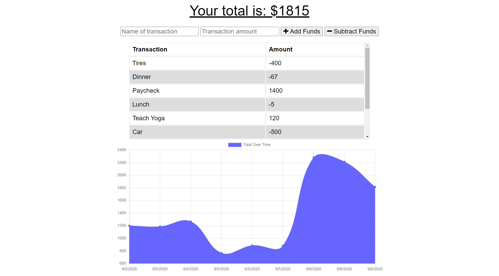

# Budget Tracker 

## Description

Budget Tracker is a single-page PWA that helps users keep track of expenses and deposits on the go, with or without an internet connection.

## Table of Contents

* [Installation](#installation)
* [Usage](#usage)
* [Contributing](#contributing)
* [License](#license)
* [Testing](#testing)
* [Questions](#questions)

## Installation

From desktop, navigate to the application URL and click the "+" icon that appears in the address bar. From an iPhone, open the application in Safari, touch the share button, then choose "Install on home screen".

## Usage 

Enter a transaction name and amount, then click "Add Funds" or "Subtract Funds". If internet connection is lost, transactions will be stored and later posted to the database upon the return of internet connection.

## License

This project is covered under the following license(s):

MIT

## Contributing

Add issues from the issues page on GitHub

## Testing

N/A

## Questions

GitHub Profile: [TRemigi](https://github.com/TRemigi)

Reach me via email at <tayremigi@gmail.com>

